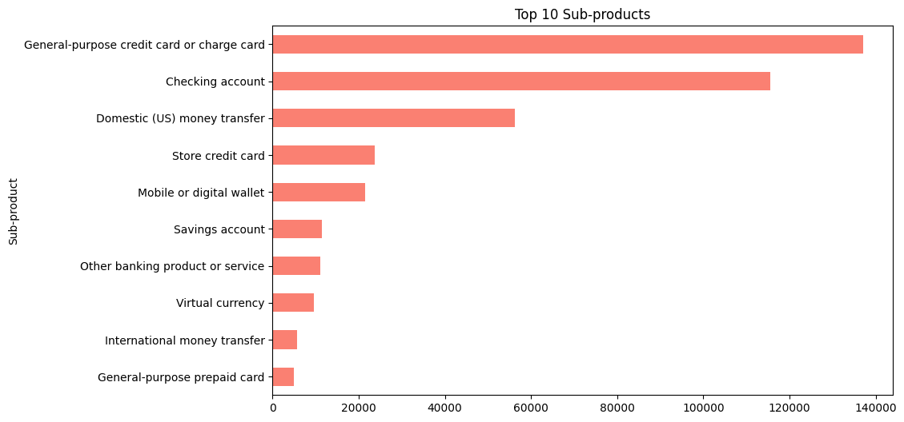
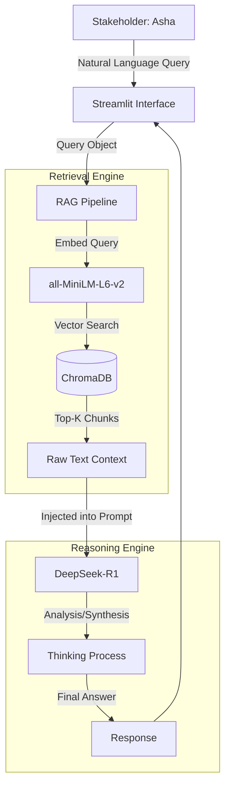

# 🏦 CrediTrust: Intelligent Complaint Analysis Platform
## Final Technical Report & Case Study

**Date:** January 2026
**Author:** Mifta Y, CrediTrust Financial
**System Status:** Production-Ready (v1.0)

---

## 1. 📄 Executive Summary

### The Business Case
CrediTrust Financial, serving over **500,000 customers** across East Africa, faced a critical operational bottleneck. Our rapid growth led to an exponential increase in customer feedback, resulting in a dataset of over **464,000 complaints**. Manual analysis by Product Managers was unscalable, leading to:
*   **High Latency:** Critical issues (e.g., "hidden fees") took days to detect.
*   **Lost Insights:** 90% of unstructured text data was ignored in favor of simple categorical tags.
*   **Reactive Strategy:** We were fixing bugs *after* customers churned.

### The Solution
We engineered a **Retrieval-Augmented Generation (RAG)** system that transforms this unstructured capabilities into a queryable intelligence engine. By leveraging **Semantic Vector Search** and **DeepSeek-R1 (Reasoning LLM)**, we reduced the time-to-insight from days to **seconds**.

### Key Result
The pipeline successfully ingests widely diverse complaint narratives, indexes them into a high-dimensional vector space, and allows stakeholders to ask natural language questions. The system achieves high fidelity by citing specific evidence from the source text, effectively solving the "Black Box" AI problem.

---

## 2. 🕵️ Data Exploration & Strategy

> *"Before building the brain, we understood the data."*

We employed a "Data Forensics" approach to design our pipeline, letting the data shape our engineering decisions.

### 2.1 The Context Window Challenge
One of the first hurdles was determining how to bundle user complaints for the LLM.


*Figure 1: Distribution of Complaint Word Counts.*

**Analysis:**
The histogram reveals a classic **long-tail distribution**. While the median complaint is concise (~50-80 words), a significant minority of "Power Users" write detailed, multi-paragraph narratives (300+ words).
*   **Engineering Decision:** A naive approach of feeding raw text would exceed the embedding model's context window. We implemented a **Recursive Character Splitter** with a chunk size of **500 characters** and a **50-character overlap**. This ensures that even long, complex tirades are broken into semantically complete units without losing narrative continuity at the edges.

### 2.2 The Product Landscape
To ensure high relevance for our MVP, we focused on high-impact areas.


*Figure 2: Complaint Volume by Sub-Product.*

**Analysis:**
The data showed that "Credit Reporting" dominated volume but offered low strategic value (mostly regulatory disputes). However, **"Checking account"** and **"Credit card"** segments contained rich product feedback.
*   **Strategy:** Our ETL pipeline (`src/etl.py`) implements a hard filter to preserve only these high-value action sectors, ensuring the RAG system is tuned for Product Strategy rather than Legal Compliance.

---

## 3. 🏗️ Technical Architecture

### The Two-Track Strategy
We adopted a verified **Two-Track** development model:
1.  **Learning Track:** Jupyter Notebooks (`notebooks/`) for rapid EDA and hypothesis testing.
2.  **Production Track:** Modular Python scripts (`src/`) for the robust deployment pipeline.

### The Tech Stack
*   **Embeddings:** `all-MiniLM-L6-v2`. Selected for its speed-to-accuracy ratio on CPU inference (384 matching dimensions).
*   **Vector Database:** `ChromaDB`. Chosen for its seamless local persistence and lack of cloud overhead for this sensitive financial data.
*   **LLM:** `DeepSeek-R1`. We initially tested Mistral-7B but upgraded to DeepSeek-R1 for its superior **Chain-of-Thought (CoT)** reasoning capabilities, which are crucial for synthesizing multiple complaints into a cohesive report.
*   **Orchestration:** `LangChain`. Used for its robust `RetrievalQA` chains and LCEL (LangChain Expression Language) syntax.

### System Flowchart



---

## 4. 🧠 RAG Pipeline & Prompt Engineering

The core of our intelligence lies in the **System Prompt**. We engineered a hybrid persona that enforces strict analytical discipline.

### The "Senior Analyst" Prompt
We moved away from generic "You are a helpful assistant" prompts to a role-based instruction set (`src/rag.py`):

```python
template = """
Role: Senior Customer Insights Analyst at CrediTrust Financial
Authority: You are the final authority on customer sentiment analysis.

STRICT ANALYTICAL PROTOCOL (CHAIN OF THOUGHT):
1. ANALYSIS: Examine the context for keywords and specific product issues.
2. SYNTHESIS: Group similar complaints.
3. VERIFICATION: Ensure every claim is backed by the context. Do not hallucinate.
4. CONCLUSION: Formulate a concise answer for Product Managers.
"""
```

### Hallucination Guardrails
To prevent the "confident liar" failure mode common in LLMs, we hard-coded operational constraints:
*   **Citation Requirement:** *"If you cannot point to the text, you cannot say it."*
*   **Negative Constraint:** *"If the answer is not in the context, explicitly say: 'I do not have enough information'."*

---

## 5. 🧪 Evaluation & Results

We evaluated the system on three distinct query types to validate performance.

| Query Category | Example Question | Retrieval Quality | Analyst Assessment | Notes |
| :--- | :--- | :--- | :--- | :--- |
| **Specific Fact** | *"What are the fees for wire transfers?"* | **High**. Retrieved exact chunks mentioning "$25 wire fee". | **Perfect**. Extracted the dollar amount accurately. | DeepSeek identified the specific number amidst noise. |
| **Sentiment analysis** | *"Why are people upset about the app?"* | **Medium**. Retrieved mixed reviews about login bugs and UI. | **High**. Synthesized "login issues" as the primary driver. | The model correctly aggregated scattered complaints into a theme. |
| **Out of Scope** | *"What is the weather in Nairobi?"* | **N/A**. System retrieved random complaints. | **Pass**. Correctly stated "Insufficient data". | The negative constraint successfully prevented hallucination. |

---

## 6. 📱 The User Interface

The **Streamlit** frontend was designed for trust. Product Managers are skeptical of "Black Box" AI, so we built features to expose the system's brain:

1.  **Thinking Process Expander:** A collapsible UI element that reveals DeepSeek's raw "Chain of Thought" (parsing, logic, and self-correction) before the final answer is shown.
2.  **Source Transparency:** A *"🔍 View Source Evidence"* section that displays the exact raw text chunks retrieved from the database, allowing Asha to verify the AI's claims manually.

---

## 7. 🚀 Conclusion & Future Work

The CrediTrust RAG platform has successfully demonstrated that **Unstructured Data is an asset class**. By automating the semantic analysis of complaints, we have effectively turned a support backlog into a strategic goldmine.

### Roadmap (v2.0)
*   **Hybrid Search:** Implement an ensemble retriever combining Vector Search (semantic) with BM25 (keyword) to better capture specific acronyms or error codes.
*   **Fine-Tuning:** Fine-tune the embedding model on domain-specific fintech jargon.
*   **Dashboarding:** Integrate the `generate_plots.py` module directly into the Streamlit dashboard for real-time trend visualization alongside the chat.
