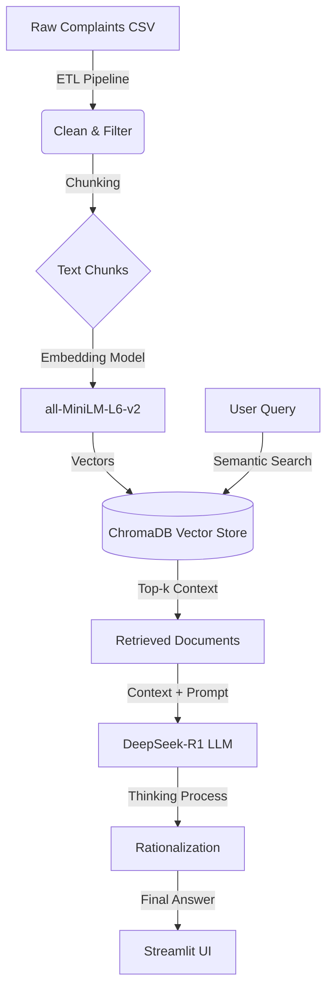

# 🏦 CrediTrust: Intelligent Complaint Analysis Platform

<div align="center">


</div>

---

### 🚨 The Business Crisis: Drowning in Feedback
CrediTrust Financial serves over **500,000 customers** across East Africa. While our growth is exponential, so is the volume of customer feedback. Our Product Managers, like Asha, are overwhelmed. They receive thousands of complaints daily—about hidden fees, failed transfers, and mobile app glitches.

Historically, analyzing this data took **days of manual tagging**, leading to slow reaction times and customer churn. Traditional keyword search failed to capture the *nuance* of user frustration (e.g., "I can't access my money" isn't just a technical bug; it's a trust crisis).

### 💡 The Solution: Artificial Intelligence
**CrediTrust RAG** is a production-grade **Retrieval-Augmented Generation (RAG)** system designed to slash "Time-to-Insight" from days to **seconds**. By combining vector search with the reasoning power of **DeepSeek-R1**, we allow non-technical stakeholders to ask complex questions like *"Why are customers leaving our Savings product?"* and receive rigorous, evidence-backed reports instantly.

---

## ✨ See It In Action


*Figure 1: The RAG Chatbot providing evidence-based answers in real-time. Note the "Thinking Process" expander showing the AI's internal reasoning.*

---

## 🏗️ High-Level Architecture

The system utilizes a modern tailored RAG pipeline. We bypass standard API wrappers to implement a custom, robust client for the **Hugging Face Router**, ensuring reliability even under high concurrency.



---

## 🗺️ Repository Map

```text
RAG-Complaint-Intelligence-Platform/
├── app.py                   #  Main Streamlit Application Entrypoint
├── debug_script.py          #  CLI Debugger for RAG Pipeline Testing
├── requirements.txt         #  Project Dependencies
├── .env                     #  API Keys configuration (GitIgnored)
├── data/
│   ├── raw/                 # Source CSV downloads
│   └── processed/           # Cleaned datasets and ChromaDB persistence
├── images/                  # 📊 Generated plots and static assets
├── notebooks/
│   ├── 01_deep_eda.ipynb    #  Data Science & Forensics Lab
│   └── 02_vector_test.ipynb #  Vector Search Validation
└── src/
    ├── config.py            #  Centralized Path Management
    ├── custom_llm.py        #  OpenAI-Compatible Client for Hugging Face Router
    ├── etl.py               #  Data Ingestion & Cleaning Logic
    ├── generate_plots.py    # 📊 Visualization Engine
    ├── rag.py               #  Core RAG Logic (Chain of Thought Prompting)
    └── utils.py             #  Helpers (Regex Parsing, Plot Saving)
```

---

## 🕵️ Data Forensics & Engineering Strategy

We adopted a **"Two-Track"** strategy:
1.  **Learning Track:** Intensive EDA in Jupyter Notebooks to understand the data shape.
2.  **Production Track:** Encapsulating insights into reusable Python modules (`src/`).

### 1. Complaint Length Analysis (Chunking Strategy)

*Figure 2: Distribution of Complaint Word Counts.*

**Analysis:** The histogram reveals a long-tailed distribution. While most complaints are concise (50-100 words), a significant "Power User" segment writes detailed essays (300+ words).
*   **Engineering Decision:** We selected a **chunk size of 500 characters** with 50 character overlap. This ensures we capture the full context of short complaints while splitting long tirades into semantically complete units, preventing the Vector DB from losing focus.

### 2. Product Breakdown (Domain Focus)

*Figure 3: Complaint Volume by Product Category.*

**Analysis:** "Credit Reporting" and "Debt Collection" dominate the noise. However, for this MVP, we filtered specifically for **high-value banking products** (Checking, Savings, Money Transfers) to focus on actionable product feedback rather than regulatory disputes. This filtration happens automatically in `src/etl.py`.

---

## ⚡ Key Features

*   **🔍 Semantic Search Engine:** unlike rigid keyword searches (SQL's `LIKE %...%`), our system chunks text into 384-dimensional vectors. This allows it to understand that *"hidden charge"* and *"unexpected deduction"* are mathematically identical concepts.
*   **📜 Evidence-Based Citations:** The prompt engineering strictly enforces a **"No Hallucination"** policy. The model must mentally link every claim to a specific sentence in the retrieved context.
*   **🧠 Chain-of-Thought Reasoning:** We utilize **DeepSeek-R1**, a "Reasoning" model. Before answering, it performs a hidden 4-step analysis (Data Audit -> Pattern Recognition -> Evidence Linking -> Synthesis). You can view this internal monologue in the UI.
*   **🔌 Custom Router Client:** To solve `410 Gone` and `ReadTimeout` errors common with free-tier APIs, we built a custom `HuggingFaceAPIWrapper` with robust error handling and extended timeouts (120s).

---

## 🛠️ Installation & Setup

Follow these steps to deploy the intelligence platform locally.

**1. Clone the Repository**
```bash
git clone https://github.com/StartUpInc/CrediTrust-RAG.git
cd CrediTrust-RAG
```

**2. Create a Virtual Environment**
```bash
# Windows
python -m venv .venv
.\.venv\Scripts\activate

# Mac/Linux
python3 -m venv .venv
source .venv/bin/activate
```

**3. Install Dependencies**
```bash
pip install -r requirements.txt
```

**4. Configure Environment**
Create a `.env` file in the root directory:
```bash
# .env
HUGGINGFACEHUB_API_TOKEN=hf_YourTokenHere
```

**5. Initialize Data**
Run the ETL pipeline to generate the vector store:
```bash
python -c "from src.etl import run_etl; run_etl()"
```

---

## 🚀 Usage

**Launch the Platform:**
```bash
streamlit run app.py
```

**sample Executive Questions:**
*   *"What are the primary complaints regarding 'Money Transfers'?"*
*   *"Are customers complaining about hidden fees in our Credit Card product?"*
*   *"Summarize the sentiment regarding our mobile app's security features."*
