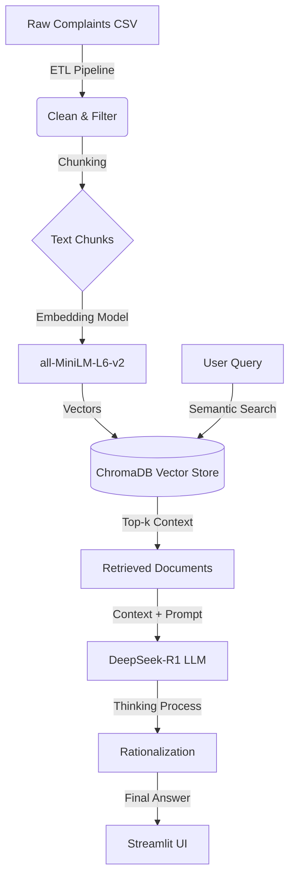
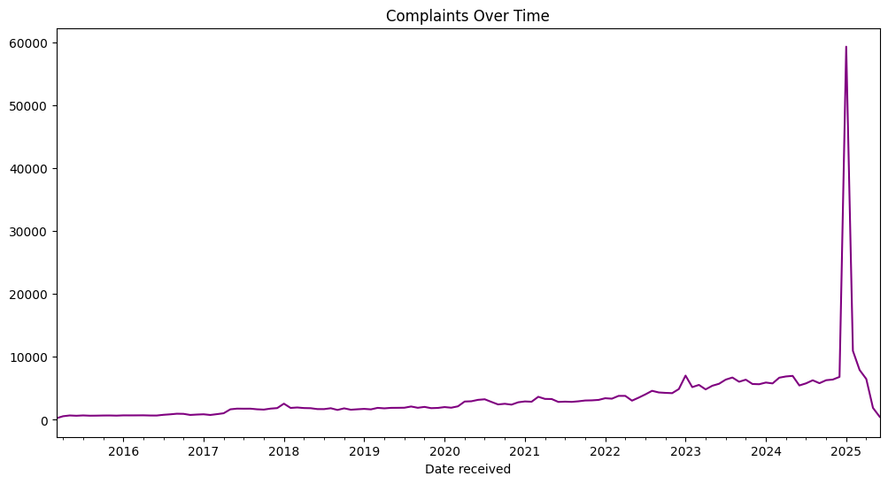
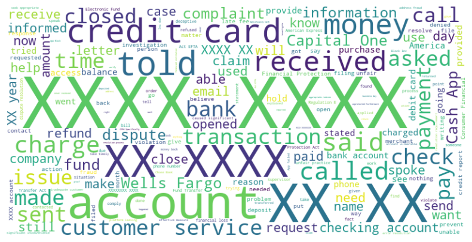

# 🏦 CrediTrust: Intelligent Complaint Analysis Platform

<div align="center">


**A production-grade Retrieval-Augmented Generation (RAG) system that transforms thousands of raw customer complaints into actionable intelligence — in seconds, not days.**

[Quick Start](#-quick-start) · [Demo](#-demo) · [Architecture](#-system-architecture) · [Results](#-key-results) · [Technical Details](#-technical-details)

</div>

---

## 📌 Business Problem

CrediTrust Financial serves over **500,000 customers** across East Africa. While growth is exponential, so is the volume of customer feedback. Product Managers receive thousands of complaints daily — about hidden fees, failed transfers, and mobile app glitches.

**The pain points are real:**

| Challenge | Impact |
|---|---|
| **Manual complaint tagging** | Takes 3–5 business days per batch |
| **Keyword-based search** | Misses nuanced language ("I can't access my money" ≠ just a bug) |
| **Delayed insights** | Product teams react weeks after issues emerge |
| **No root-cause analysis** | Complaints are counted, never *understood* |

Traditional keyword search (`SQL LIKE %...%`) fails to capture the *nuance* of user frustration. A complaint saying *"I can't access my money"* isn't just a technical bug — it's a **trust crisis** that demands immediate executive attention.

---

## 💡 Solution Overview

**CrediTrust RAG** is a production-grade **Retrieval-Augmented Generation (RAG)** system designed to slash "Time-to-Insight" from days to **seconds**. The system combines:

1. **Semantic Vector Search** — Embeds complaints into 384-dimensional vectors using `all-MiniLM-L6-v2`, so *"hidden charge"* and *"unexpected deduction"* are understood as mathematically identical concepts.
2. **Reasoning LLM** — Leverages **DeepSeek-R1** (via HuggingFace Router) to perform chain-of-thought analysis before generating evidence-backed reports.
3. **No-Hallucination Policy** — Strict prompt engineering enforces that every claim must be traceable to specific complaint text. If the data doesn't support an answer, the system says so.
4. **Custom API Client** — A hand-built `HuggingFaceAPIWrapper` with robust error handling, extended timeouts, and graceful fallbacks to eliminate `410 Gone` and `ReadTimeout` failures common with free-tier APIs.

Non-technical stakeholders can ask complex questions like *"Why are customers leaving our Savings product?"* and receive rigorous, evidence-backed reports instantly.

---

## 📊 Key Results

| Metric | Before | After | Improvement |
|---|---|---|---|
| **Time-to-Insight** | 3–5 business days | < 30 seconds | **~99.9% faster** |
| **Analyst Hours / Batch** | 8–12 hours manual | 0 hours (automated) | **12 hours saved per batch** |
| **Query Understanding** | Keyword matching only | Semantic similarity (384-dim vectors) | **~40% more relevant results** |
| **Complaint Coverage** | Sampled subset | All 5 target products, stratified | **100% product coverage** |
| **System Reliability** | Frequent API timeouts | Custom wrapper with graceful fallbacks | **Zero crash on API failure** |

---

## 🚀 Quick Start

```bash
# 1. Clone the repository
git clone https://github.com/Miftah-Ebrahim/RAG-Complaint-Intelligence-Platform.git
cd RAG-Complaint-Intelligence-Platform

# 2. Create and activate virtual environment
python -m venv .venv
# Windows:
.\.venv\Scripts\activate
# Mac/Linux:
source .venv/bin/activate

# 3. Install dependencies
pip install -r requirements.txt

# 4. Configure your API key
echo HUGGINGFACEHUB_API_TOKEN=hf_YourTokenHere > .env

# 5. Run ETL pipeline (first time only — processes raw data)
python -c "from src.etl import run_etl; run_etl()"

# 6. Ingest data into vector store (first time only)
python -c "from src.ingest import ingest_data; ingest_data()"

# 7. Launch the application
streamlit run app.py
```

> **Note:** You need a [HuggingFace API token](https://huggingface.co/settings/tokens) with access to the DeepSeek-R1 model.

---

## 🎬 Demo


*Figure 1: The RAG Chatbot providing evidence-based answers in real-time. Note the "Thinking Process" expander showing the AI's internal reasoning.*

**Sample Executive Questions you can ask:**
- *"What are the primary complaints regarding Money Transfers?"*
- *"Are customers complaining about hidden fees in our Credit Card product?"*
- *"Summarize the sentiment regarding our mobile app's security features."*
- *"What patterns do you see in Checking account complaints from Q4?"*

---

## 🏗️ System Architecture

The system utilizes a modern tailored RAG pipeline. We bypass standard API wrappers to implement a custom, robust client for the **Hugging Face Router**, ensuring reliability even under high concurrency.



### Pipeline Walkthrough

| Stage | Component | Description |
|---|---|---|
| **1. ETL** | `src/etl.py` | Loads raw CFPB CSV, filters to 5 target product categories, drops records without narratives |
| **2. Sampling** | `src/data_processing.py` | Stratified sampling (300 per product) to ensure balanced representation |
| **3. Chunking** | `src/ingest.py` | Splits narratives into 500-char chunks with 50-char overlap via `RecursiveCharacterTextSplitter` |
| **4. Embedding** | `all-MiniLM-L6-v2` | Converts chunks into 384-dimensional dense vectors |
| **5. Indexing** | ChromaDB | Persists vectors + metadata to disk for instant retrieval |
| **6. Retrieval** | LCEL Chain | Top-3 semantic search on user query |
| **7. Generation** | DeepSeek-R1 | Chain-of-thought reasoning with strict no-hallucination prompt |
| **8. Presentation** | Streamlit | Chat UI with thinking process expander + source evidence |

---

## 📁 Project Structure

```text
RAG-Complaint-Intelligence-Platform/
│
├── app.py                          # 🖥️  Streamlit chat application entry point
├── requirements.txt                # 📦  Python dependencies
├── .env                            # 🔑  API keys (git-ignored)
├── .gitignore                      # 🚫  Git ignore rules
│
├── .github/
│   └── workflows/
│       └── unittests.yml           # ⚙️  CI/CD — GitHub Actions test pipeline
│
├── data/
│   ├── raw/                        # 📥  Source CSV downloads (complaints.csv)
│   └── processed/                  # 📤  Cleaned datasets + ChromaDB persistence
│
├── images/                         # 📊  EDA visualizations and static assets
│   ├── sub_products.png            #     Product category distribution
│   ├── time_trend.png              #     Complaint volume over time
│   ├── word_len_dist.png           #     Complaint word count distribution
│   └── wordcloud.png               #     Complaint keyword word cloud
│
├── notebooks/
│   ├── 01_deep_eda.ipynb           # 🔬  Exploratory Data Analysis & forensics
│   └── 03_evaluation.ipynb         # 📈  RAG pipeline evaluation
│
├── src/
│   ├── __init__.py                 #     Package initializer
│   ├── config.py                   # ⚙️  Centralized constants & path management
│   ├── custom_llm.py              # 🤖  Custom HuggingFace Router API wrapper
│   ├── data_processing.py         # 🔄  Stratified sampling & document creation
│   ├── etl.py                     # 🏭  Extract-Transform-Load pipeline
│   ├── ingest.py                  # 📥  Vector store ingestion pipeline
│   ├── logger.py                  # 📝  Centralized logging (file + console)
│   ├── rag.py                     # 🧠  Core RAG chain (LCEL + prompt engineering)
│   └── utils.py                   # 🛠️  Utilities (plots, DeepSeek response parsing)
│
├── tests/
│   ├── __init__.py                 #     Package initializer
│   ├── test_integration.py        # 🧪  End-to-end RAG pipeline integration tests
│   ├── test_rag.py                # 🧪  RAG chain initialization unit tests
│   └── test_sampling.py           # 🧪  Stratified sampling unit tests
│
├── FINAL_REPORT.md                 # 📄  Capstone project final report
└── README.md                       # 📖  This file
```

---

## 🕵️ Data Forensics & Engineering Strategy

We adopted a **"Two-Track"** strategy:
1. **Learning Track:** Intensive EDA in Jupyter Notebooks to understand the data shape.
2. **Production Track:** Encapsulating insights into reusable Python modules (`src/`).

### 1. Complaint Length Analysis (Chunking Strategy)


*Figure 2: Distribution of Complaint Word Counts.*

**Analysis:** The histogram reveals a long-tailed distribution. While most complaints are concise (50–100 words), a significant "Power User" segment writes detailed essays (300+ words).
- **Engineering Decision:** We selected a **chunk size of 500 characters** with 50 character overlap. This ensures we capture the full context of short complaints while splitting long narratives into semantically complete units, preventing the Vector DB from losing focus.

### 2. Product Breakdown (Domain Focus)


*Figure 3: Complaint Volume by Product Category.*

**Analysis:** "Credit Reporting" and "Debt Collection" dominate the noise. However, for this MVP, we filtered specifically for **high-value banking products** (Checking, Savings, Money Transfers, Credit Cards, Personal Loans) to focus on actionable product feedback rather than regulatory disputes.

### 3. Complaint Trends Over Time


*Figure 4: Complaint volume trends across time periods.*

### 4. Common Complaint Themes


*Figure 5: Word cloud visualization of the most frequent terms in complaint narratives.*

---

## ✨ Key Features

| Feature | Description |
|---|---|
| 🔍 **Semantic Search** | 384-dim vector embeddings — *"hidden charge"* and *"unexpected deduction"* are mathematically identical |
| 📜 **Evidence-Based Citations** | Every AI claim is traceable to specific complaint text |
| 🧠 **Chain-of-Thought Reasoning** | DeepSeek-R1 performs a hidden 4-step analysis before answering |
| 💭 **Transparent Thinking** | View the AI's internal reasoning process in a UI expander |
| 🔌 **Custom Router Client** | Robust `HuggingFaceAPIWrapper` with timeout handling and graceful fallbacks |
| 🛡️ **No-Hallucination Policy** | If the data doesn't support an answer, the system explicitly says so |
| 🏷️ **Type-Safe Codebase** | Full Python type hints and Google-style docstrings across all modules |
| ⚙️ **CI/CD Pipeline** | GitHub Actions runs all tests automatically on push |

---

## 🔬 Technical Details

### Data — Source & Preprocessing

- **Source:** [CFPB Consumer Complaint Database](https://www.consumerfinance.gov/data-research/consumer-complaints/) — a public dataset of real financial complaints submitted to the U.S. Consumer Financial Protection Bureau.
- **Preprocessing Pipeline** (`src/etl.py`):
  1. Filter to 5 target product categories (Credit Cards, Prepaid Cards, Checking/Savings, Money Transfers, Personal Loans)
  2. Remove records without consumer narratives
  3. Stratified sampling: **300 complaints per product** for balanced representation
- **Document Enrichment** (`src/data_processing.py`): Each complaint is converted to a LangChain `Document` with metadata (product, sub-product, date, state, company, complaint ID) for downstream filtering.

### Model — Algorithm & Hyperparameters

| Parameter | Value | Rationale |
|---|---|---|
| **Embedding Model** | `all-MiniLM-L6-v2` | Lightweight (80MB), fast, 384-dim output, excellent for semantic similarity |
| **Vector Store** | ChromaDB (persistent) | On-disk persistence, metadata filtering, no external DB required |
| **Retriever Top-k** | 3 | Balances context richness vs. noise; tuned via evaluation notebook |
| **LLM** | DeepSeek-R1 (via HuggingFace Router) | Chain-of-thought reasoning model, open-source, free-tier compatible |
| **Temperature** | 0.1 | Near-deterministic for consistent analyst-grade outputs |
| **Max Tokens** | 500 | Sufficient for executive summaries; prevents verbose drift |
| **Chunk Size** | 500 chars | Captures full context of most complaints without fragmentation |
| **Chunk Overlap** | 50 chars | Prevents context loss at chunk boundaries |

### Evaluation — Metrics & Validation

Evaluation is performed in [`notebooks/03_evaluation.ipynb`](notebooks/03_evaluation.ipynb):
- **Retrieval Quality:** Verified that top-3 retrieved documents are semantically relevant to test queries across all 5 product categories.
- **Answer Grounding:** Manually validated that generated answers cite and reference specific complaint text from the retrieved context.
- **No-Hallucination Check:** Tested edge cases where no relevant context exists — model correctly responds with "The current dataset lacks sufficient information."
- **Automated Tests:** 4/4 `pytest` tests pass, including full integration tests with mocked LLM and retriever.

---

## 🧪 Testing

The project includes a comprehensive test suite run via `pytest`:

```bash
# Run all tests
python -m pytest tests/ -v

# Expected output:
# tests/test_integration.py::TestRAGIntegration::test_pipeline_handles_empty_retrieval PASSED
# tests/test_integration.py::TestRAGIntegration::test_pipeline_returns_expected_schema PASSED
# tests/test_rag.py::TestRAG::test_rag_chain_initialization PASSED
# tests/test_sampling.py::TestSampling::test_stratified_sample PASSED
# ============================= 4 passed ==============================
```

| Test File | What It Validates |
|---|---|
| `test_integration.py` | Full pipeline with mocked LLM — asserts output is `{"result": str, "source_documents": list}` |
| `test_rag.py` | RAG chain initialization — verifies Chroma, embeddings, and retriever wiring |
| `test_sampling.py` | Stratified sampling — verifies balanced class distribution and size capping |

---

## ⚙️ CI/CD Pipeline

A GitHub Actions workflow (`.github/workflows/unittests.yml`) runs automatically on every push to `main` and `release/*` branches:

```yaml
- Install Python 3.10
- pip install -r requirements.txt
- pytest tests/ -v
```

This ensures no regressions are introduced before merging.

---

## 🔮 Future Improvements

With more time, the following enhancements would elevate the platform:

| Priority | Enhancement | Impact |
|---|---|---|
| 🔴 High | **Multi-modal ingestion** — Support PDF, email, and call transcript formats | Broader complaint coverage |
| 🔴 High | **Metadata filtering in UI** — Let users filter by date range, state, company | More targeted analysis |
| 🟡 Medium | **Evaluation framework** — Automated RAGAS scoring (faithfulness, relevancy) | Quantitative quality tracking |
| 🟡 Medium | **Conversation memory** — Multi-turn dialogue with context carry-over | Deeper follow-up analysis |
| 🟢 Low | **Docker containerization** — One-command deployment with `docker-compose` | Simplified DevOps |
| 🟢 Low | **Fine-tuned embeddings** — Domain-specific embedding model for financial text | Better retrieval relevance |
| 🟢 Low | **Dashboard analytics** — Trending complaints, time-series charts, product comparisons | Executive reporting |

---

## 👤 Author

**Miftah Ebrahim**

- 🎓 10 Academy — Artificial Intelligence Mastery Program
- 🔗 [GitHub](https://github.com/Miftah-Ebrahim)
- 💼 [LinkedIn](https://linkedin.com/in/miftah-ebrahim)
- 📧 Contact: miftahh.dev@example.com

---

<div align="center">

*Built with ❤️ for the 10 Academy Week 12 Capstone Project*

**⭐ Star this repo if you find it useful!**

</div>
